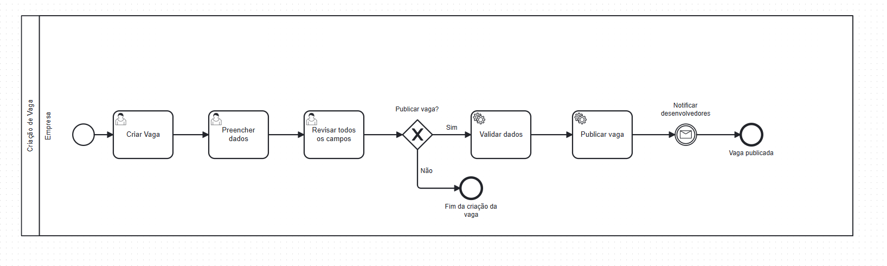
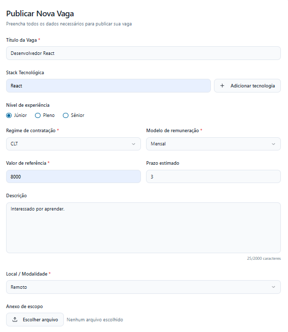
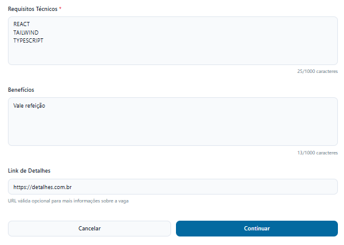
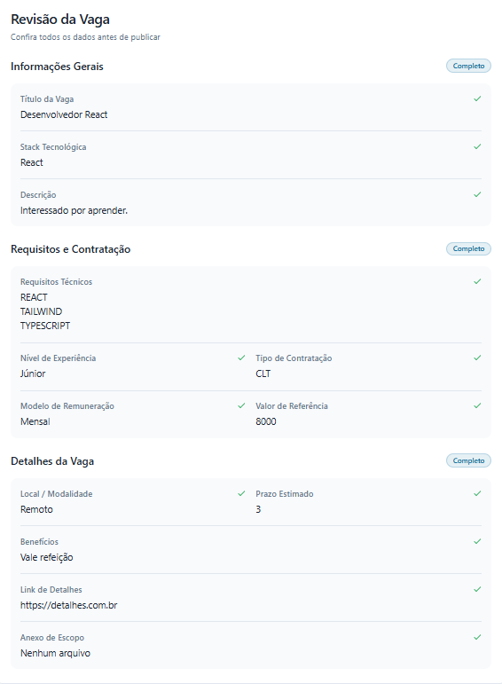

# 3.3.1 Processo 1 – Criação de Vaga

## Descrição do Processo

O processo de criação de vaga ocorre no ambiente web da plataforma DevMatch, permitindo que empresas cadastrem, validem e publiquem oportunidades de trabalho. Nesse processo, a empresa é responsável por inserir e revisar todas as informações da vaga, garantindo sua completude e veracidade antes da publicação. O fluxo tem início quando a empresa decide criar uma nova vaga e se encerra no momento em que ela é publicada e notificada aos desenvolvedores cadastrados. Esse procedimento assegura padronização, transparência e agilidade no gerenciamento das oportunidades, garantindo que todas as informações sejam devidamente verificadas antes da publicação.

## Oportunidades de Melhoria

- **Validação automática de dados**: aplicar regras para orçamento, regime de contratação e campos obrigatórios antes da publicação.  
- **Notificação em tempo real**: alertar os desenvolvedores imediatamente após a publicação da vaga.  
- **Tratamento de erros**: exibir mensagens claras em caso de falha na validação ou publicação.  

---

## Modelo do Processo

**Lanes**: Empresa, Plataforma  
**Eventos**: início, decisão (gateway), mensagem, fim_publicacao, fim_cancelamento  

---

## Etapas do Processo

### Etapa 1 – Criar Vaga (Empresa)

A empresa inicia o processo informando os dados básicos da vaga.

| **Campo**          | **Tipo**      | **Restrições**                | **Valor default** |
| ------------------ | ------------- | ----------------------------- | ----------------- |
| titulo_vaga        | text_box      | obrigatório                   | —                 |
| stack_tecnologica  | multi_select  | mínimo 1                      | —                 |
| nivel_experiencia  | single_select | júnior / pleno / sênior       | júnior            |
| regime_contratacao | single_select | CLT / PJ / Freelancer         | —                 |
| modelo_remuneracao | single_select | hora / sprint / mensal        | —                 |
| valor_referencia   | number        | > 0                           | —                 |
| prazo_estimado     | date          | obrigatório                   | —                 |
| descricao          | text_area     | 10–2000 chars                 | —                 |
| local_modalidade   | single_select | remoto / híbrido / presencial | remoto            |
| anexo_escopo       | file          | opcional                      | —                 |

**Comandos**
- continuar → vai para “Preencher Dados”
- cancelar → fim_cancelamento

---

### Etapa 2 – Preencher Dados (Empresa)

A empresa complementa as informações da vaga com requisitos técnicos e detalhes adicionais.

| **Campo**           | **Tipo**  | **Restrições**        | **Valor default** |
| ------------------- | --------- | --------------------- | ----------------- |
| requisitos_tecnicos | text_area | obrigatório           | —                 |
| beneficios          | text_area | opcional              | —                 |
| link_detalhes       | link      | opcional (URL válida) | —                 |

**Comandos**
- revisar → vai para “Revisar todos os campos”
- cancelar → fim_cancelamento
 

---

### Etapa 3 – Revisar Todos os Campos (Empresa)

A empresa visualiza um resumo consolidado da vaga antes da publicação.

| **Campo**   | **Tipo** | **Restrições** | **Valor default** |
| ----------- | -------- | -------------- | ----------------- |
| resumo_vaga | table    | leitura apenas | gerado automaticamente |

**Comandos**
- publicar_vaga → vai para “Validar Dados”
- editar → retorna para “Preencher Dados”

---

## Encerramento do Processo

- **Fim 1 – Vaga publicada com sucesso:** a plataforma envia notificações aos desenvolvedores.  
- **Fim 2 – Cancelamento:** o processo é encerrado antes da publicação.  
