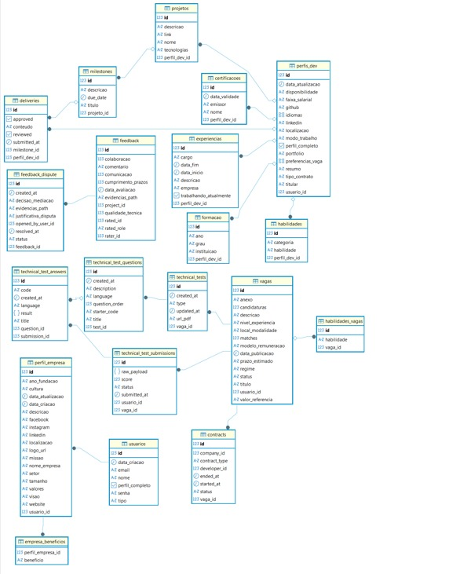

## 4. Projeto da solução

### 4.1. Modelo de dados

_Abaixo, segue o modelo de dados relacional que contempla todos os conceitos e atributos da modelagem dos processos_

### 4.2. Tecnologias

## 1. SGBD: Supabase
- **Descrição**: Plataforma open-source baseada em PostgreSQL, oferecendo banco de dados relacional, autenticação, APIs automáticas e armazenamento em tempo real.
- **Função**: Armazena dados persistentes (ex.: usuários, desenvolvedores, empresas) e fornece APIs REST/GraphQL para integração com o back-end via Spring Data JPA ou cliente HTTP.
- **Pontos fortes**: Fácil configuração, escalável, suporte a tempo real, autenticação integrada.

## 2. Front-end: React
- **Descrição**: Biblioteca JavaScript para interfaces de usuário dinâmicas e componentizadas (SPAs).
- **Função**: Cria UI interativa, consumindo APIs do back-end ou Supabase via Axios ou Fetch.
- **Pontos fortes**: Virtual DOM, componentização, ecossistema rico (React Router, Material-UI).

## 3. Back-end: Java com Spring Boot
- **Descrição**: Framework Java para construção de APIs RESTful e microserviços.
- **Função**: Processa lógica de negócios, conecta front-end ao Supabase via JPA ou cliente HTTP.
- **Pontos fortes**: Configuração simplificada, robusto, seguro (Spring Security), escalável.

## 4. Deploy: GitHub Pages
- **Descrição**: Serviço para hospedar sites estáticos a partir de repositórios GitHub.
- **Função**: Hospeda o build estático do front-end React. Back-end e Supabase requerem hospedagem separada (ex.: Supabase para DB, Heroku/AWS para back-end).
- **Pontos fortes**: Gratuito, fácil integração com GitHub, ideal para SPAs.
  
## Integração
O React consome APIs REST/GraphQL do Supabase ou do Spring Boot, que acessa o Supabase para gerenciar dados. O front-end é hospedado no GitHub Pages, enquanto o back-end e o banco de dados utilizam serviços cloud (Supabase para DB, servidor para Spring Boot).

| **Dimensão**   | **Tecnologia**  |
| ---            | ---             |
| SGBD           | Supabase        |
| Front end      | React           |
| Back end       | Java SpringBoot |
| Deploy         | Github Pages    |

